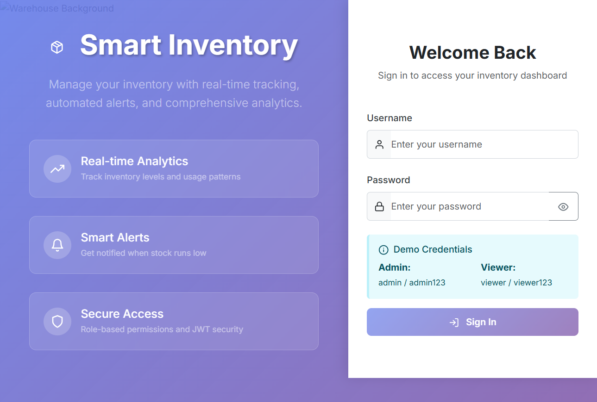
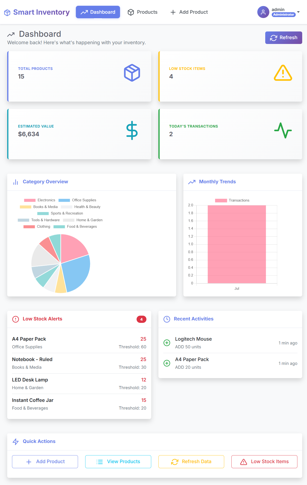
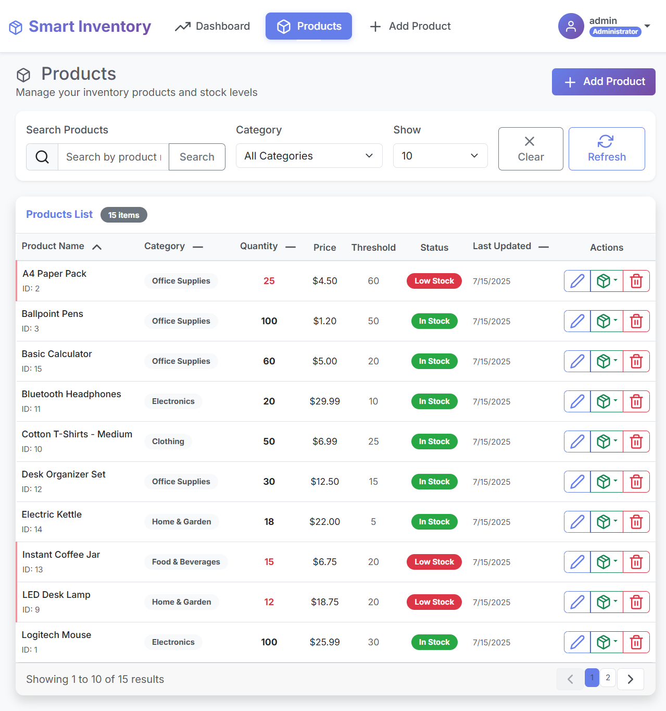
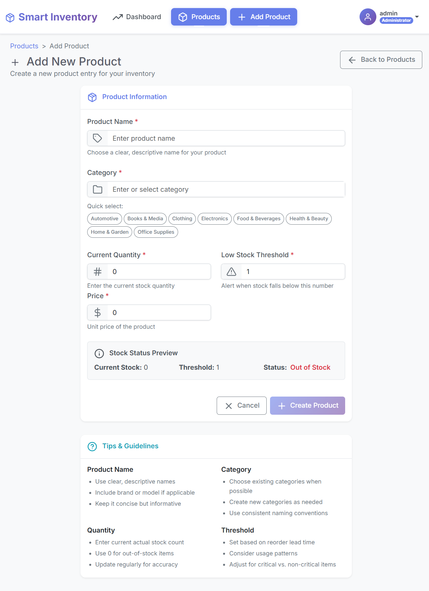

# Smart Inventory Management System

A full-stack web application to manage product inventory, built with **Spring Boot** (backend) and **Angular** (frontend).

## 🚀 Features

- ✅ Secure JWT-based authentication
- 📊 Dashboard with inventory stats
- 🧾 CRUD operations for products
- 📉 Low-stock alerts
- 🔐 Role-based access (Admin / Viewer)
- 🌐 REST API with pagination and filtering

## 🛠️ Technologies Used

### 🔙 Backend
- Java 17
- Spring Boot
- Spring Security
- JPA (Hibernate)
- JWT Authentication
- Maven
- MySQL

### 🔜 Frontend
- Angular 16
- TypeScript
- RxJS
- Chart.js
- ng2-charts@4.1.1
- Feather-icons
- Angular Routing & Guards

> 📦 **Required Frontend Libraries:**
> Run the following commands to install (In case it hasn't been installed through package.json):
> ```bash
> npm install feather-icons
> npm install chart.js
> npm install ng2-charts@4.1.1
> ```

### 🧰 Tools & IDEs
- Postman
- STS (Spring Tool Suite)
- Visual Studio Code
- Git & GitHub

## 📂 Project Structure

```
project-root/
├── backend/      # Spring Boot API (STS-compatible)
├── frontend/     # Angular app
└── README.md
```

## 🔧 Getting Started

### Prerequisites
- Node.js 18+
- Angular CLI
- Java 17+
- MySQL
- Spring Tool Suite (STS)

### Backend Setup

1. Open the project in **Spring Tool Suite (STS)** as a Maven project.
2. Rename `application-sample.properties` to `application.properties` inside:
   `src/main/resources/`
3. Set your local config values:
   ```properties
   spring.datasource.username=your-username
   spring.datasource.password=your-password
   jwt.secret=your-jwt-secret-key-here
   ```
4. Right-click the project → **Run As → Spring Boot App**

### 🔐 Generating Your JWT Secret Key

To generate a secure JWT secret key, run the following Java class:

📄 `src/main/java/com/inventory/util/JwtKeyGenerator.java`

#### Steps:
1. Open the file in your IDE (e.g., STS)
2. Right-click → **Run as Java Application**
3. Copy the printed key from the console
4. Paste it into your `application.properties` file:

```properties
jwt.secret=PASTE-YOUR-GENERATED-SECRET-HERE
```

> ⚠️ Never commit your real secret key to version control or public repositories.

### Frontend Setup

```bash
cd frontend
npm install
ng serve
```

Visit: `http://localhost:4200`

## 🔪 Demo Login

| Role   | Username | Password    |
| ------ | -------- | ----------- |
| Admin  | `admin`  | `admin123`  |
| Viewer | `viewer` | `viewer123` |

## 📸 Screenshots

### 🔐 Login Page


### 📊 Dashboard View


### 📦 Product List Table


### ➕ Add New Product


> 💡 Save your screenshots in an `assets/` folder at the root level of your project for these links to work correctly on GitHub.

## 📃 License

This project is open-source. Feel free to use and modify under the [MIT License](LICENSE).
